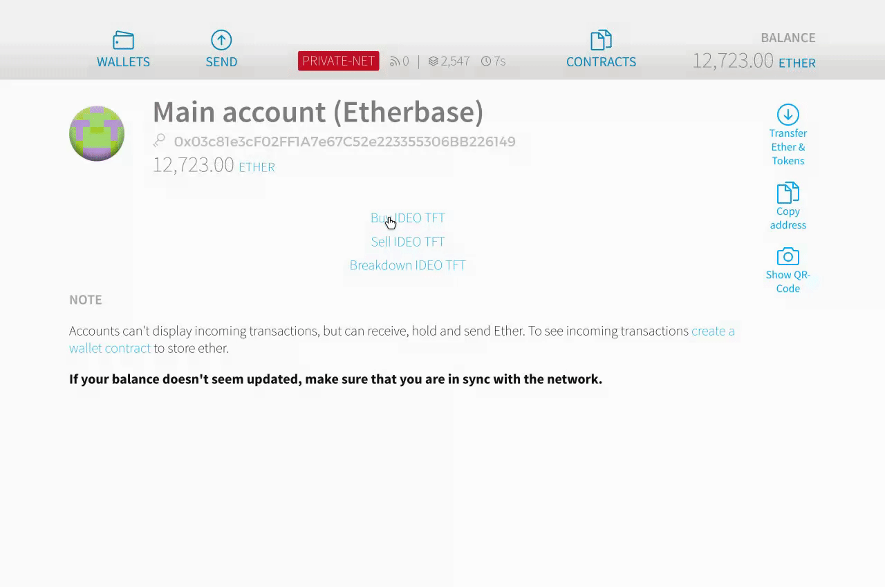

# OpenBasket

An Ethereum-based Smart Contract that makes buying and selling multiple cryptocurrencies easy and transparent.

Made by Sisi Messick, Ethan Ouimet, and William Wu as part of the IDEO CoLab.

